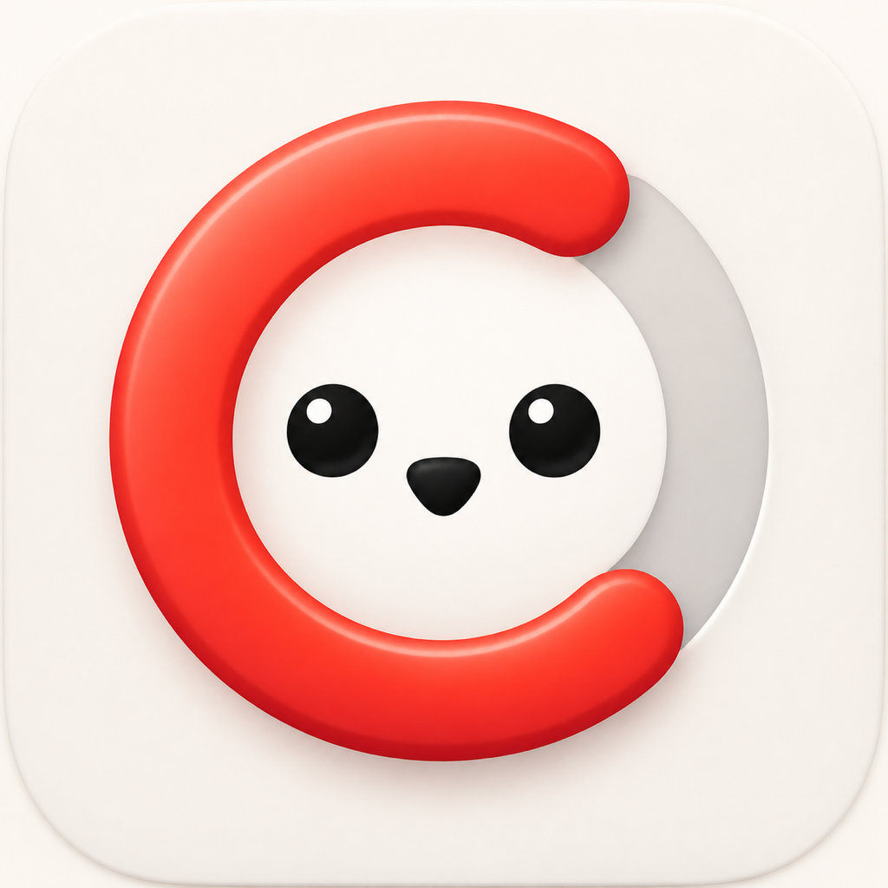
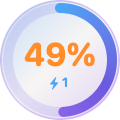
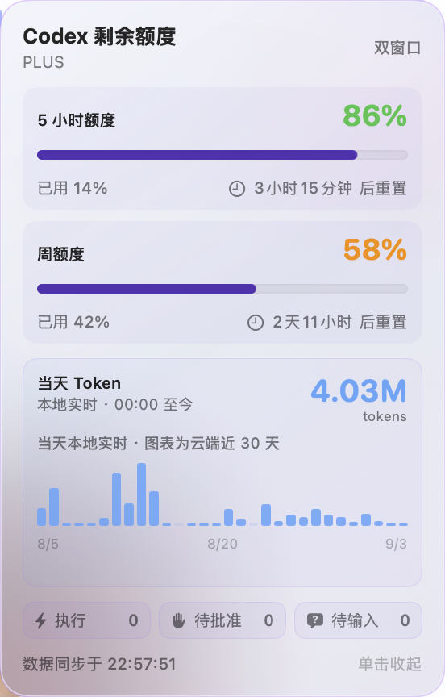
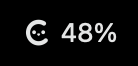
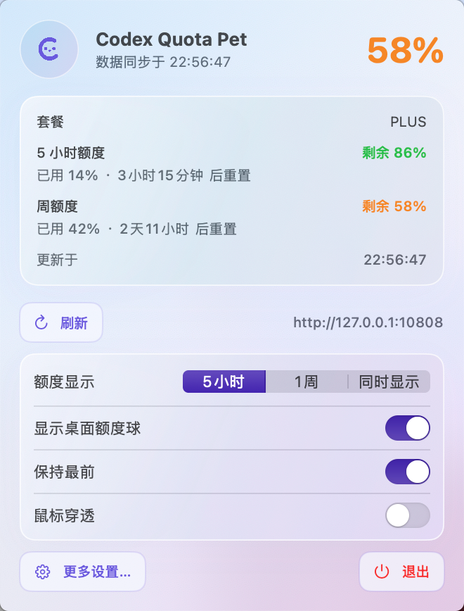
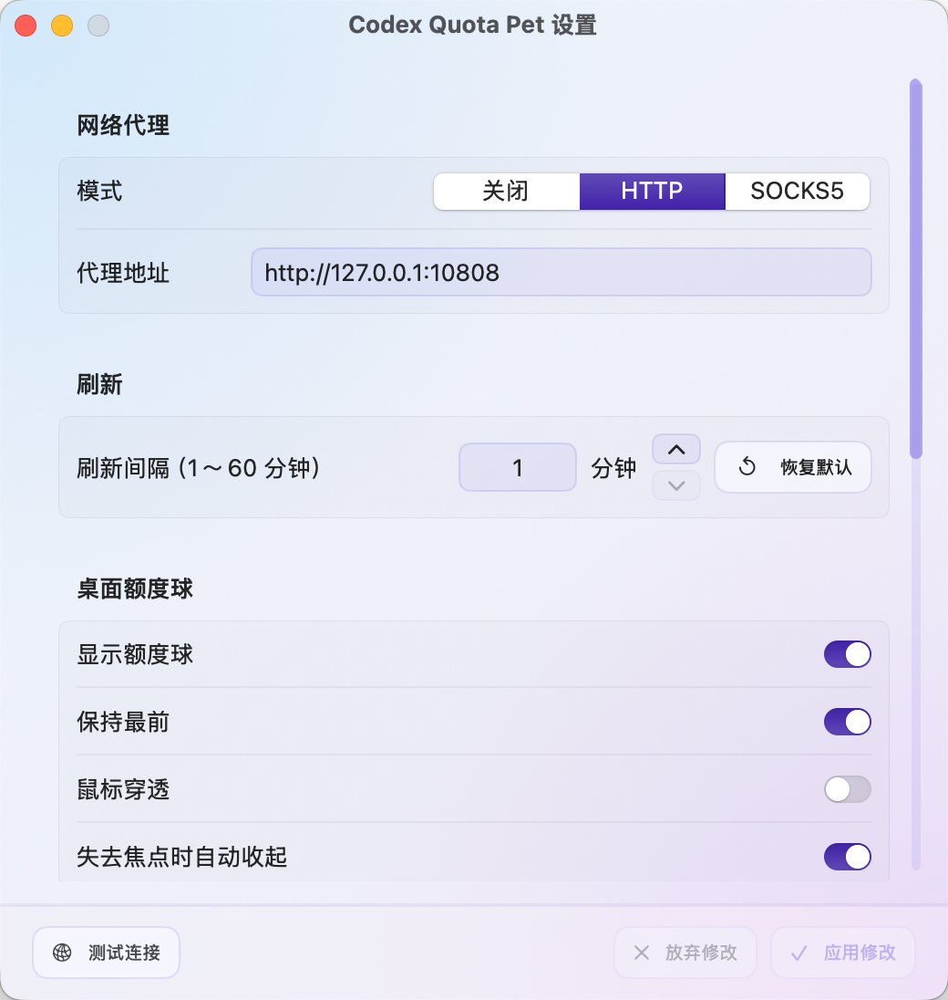
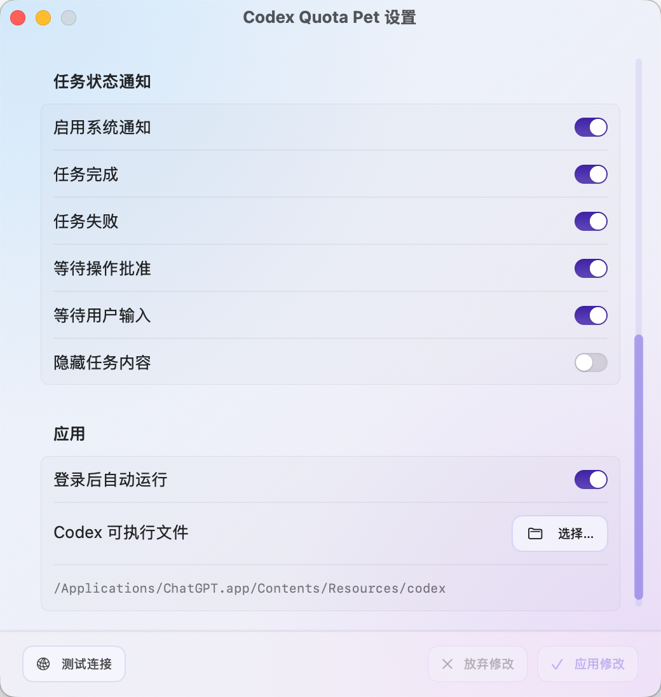
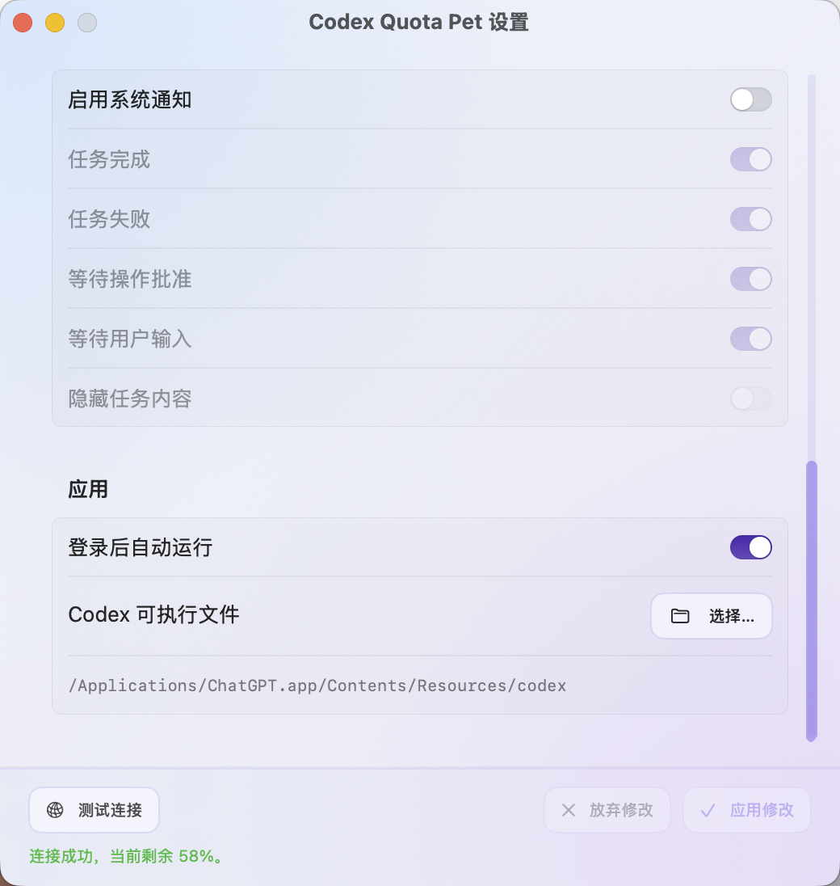

# Codex Quota Pet

<p align="center">
  
</p>

<p align="center"><strong>隐私优先的 Codex 本地用量与工作流观测工具。</strong></p>

<p align="center">
  <a href="README.md">English</a> ·
  <a href="https://github.com/HZGuoo/codex-quota-pet/releases/latest">下载</a> ·
  <a href="docs/CORE_API.md">Core API</a> ·
  <a href="ROADMAP.md">路线图</a>
</p>

Codex Quota Pet 是开源 macOS 监控应用和可复用 Swift Package，用于查看 Codex 额度窗口、聚合 Token 用量和顶层任务状态。它只通过本机 `codex app-server` 和 Codex 会话文件中的必要元数据工作，不读取或保存认证 Token、提示词或回复正文。

可拖动的桌面额度球只是一个可选界面。同一个 `CodexQuotaPetCore` 核心库和 `codex-observe` 命令行工具也可以供其他本地工具与维护流程使用。

> [!NOTE]
> 这是社区维护的非官方项目，与 OpenAI 没有隶属或背书关系。Codex、ChatGPT 和 OpenAI 是其各自权利人的商标。

## 与官方 Codex Pet 的区别

官方 Pet 侧重宠物外观、快速发起聊天和跟踪任务活动；本项目侧重可导出的本地用量与额度观测。

| 能力 | 官方 Codex Pet | Codex Quota Pet |
| --- | --- | --- |
| 动画悬浮宠物 | 支持 | 可选额度球 |
| 打开并跟踪聊天 | 支持 | 顶层状态快捷入口 |
| 订阅额度窗口 | — | 支持 |
| 每日聚合 Token 历史 | — | 支持 |
| JSON、CSV 导出 | — | `codex-observe` 支持 |
| 可复用 Swift API | — | 支持 |
| 代理失败时禁止直连 | — | 支持 |
| 项目自有遥测服务器 | 不适用 | 无 |

对比依据是 2026 年 9 月的[官方 Pets 文档](https://learn.chatgpt.com/docs/pets)，上游功能可能变化。

## 功能

- 菜单栏实时显示最紧张额度窗口的剩余百分比，菜单、设置页和悬浮窗统一采用“极光雾”蓝紫毛玻璃风格
- 支持多额度桶、主/次窗口、重置时间和套餐信息
- 透明桌面额度球，可拖动、展开、跨 Space、保持最前或鼠标穿透，并可设置失去焦点时是否自动收起
- 额度球实时显示运行中、等待批准和等待输入的顶层任务数量
- 展开额度球后可点击执行、待批准或待输入状态卡，快速切换到 Codex 桌面应用
- 展开额度球可显示本地实时的当天 Token 总量，并使用云端数据绘制最近 30 个完整自然日（不含当天）的每日使用柱状图
- 默认关闭代理；启用后默认地址为 `http://127.0.0.1:10808`，支持 HTTP 和 SOCKS5
- 代理失败时不会自动直连
- 默认每 1 分钟刷新，可在 1～60 分钟之间输入或步进配置
- 监控 Codex 顶层任务的新状态，支持完成、失败、等待批准和等待输入的系统通知
- 点击任务状态通知可直接打开 Codex 桌面应用中的对应会话；旧版 Codex 不支持会话路由时会自动退化为激活应用
- 通知按任务和状态去重，启动时已有状态不会补发；可选择隐藏通知中的任务内容
- 可选登录后自动运行
- 可在设置中手动检查 GitHub 新版本
- 提供 Swift Core API 和 `codex-observe` JSON、CSV 导出
- 复用本机 Codex 登录，不读取或保存 token

额度和最近 30 天 Token 图表通过本机 `codex app-server` 从 Codex 服务读取；当天 Token 总量从 `~/.codex/sessions` 的 `token_count` 元数据实时汇总，不解析对话正文。任务通知也会只读监听该目录中的任务状态，以兼容 ChatGPT 桌面端使用独立 stdio App Server 的情况。应用不会修改任务、自动批准操作或读取认证 token。

隐私边界和本机数据使用方式详见 [docs/PRIVACY.zh-CN.md](docs/PRIVACY.zh-CN.md)。

## 界面预览

### 桌面额度球

<p>
  
  
</p>

### 菜单栏与快捷界面

<p>
  
  
</p>

### 设置

<p>
  
  
  
</p>

## 要求

- macOS 13 或更新版本
- Apple Silicon 或 Intel Mac（默认构建为 arm64 + x86_64 Universal 2 应用）
- ChatGPT 应用或 Codex CLI，并已使用 ChatGPT 账号登录
- Swift 6 工具链；正式签名和公证需要完整 Xcode 与 Apple Developer 证书

## 安装

从 [GitHub Releases](https://github.com/HZGuoo/codex-quota-pet/releases/latest) 下载名称形如 `CodexQuotaPet-<版本>-macos-universal.zip` 的安装包，解压后将 `Codex Quota Pet.app` 拖入“应用程序”文件夹。

> [!WARNING]
> GitHub Release 二进制使用临时签名，尚未经过 Apple 公证。macOS 首次阻止启动时，可在 Finder 中右键应用并选择“打开”；也可以按照下方步骤从源码构建。

仓库已提供 Homebrew Cask，可从源码检出后验证：

```bash
brew install --cask ./Casks/codex-quota-pet.rb
```

首个正式签名、公证版本发布后，再将 Cask 放入公共 Tap 提供一条命令安装。签名和公证配置见 [docs/RELEASING.md](docs/RELEASING.md)。

## CLI 与 Core API

```bash
swift run codex-observe --format json
swift run codex-observe --format csv > codex-usage.csv
```

Swift Package 使用方式见 [docs/CORE_API.md](docs/CORE_API.md)，App Server 交互与合成协议样本见 [docs/APP_SERVER_PROTOCOL.md](docs/APP_SERVER_PROTOCOL.md)，版本验证情况见 [docs/COMPATIBILITY.md](docs/COMPATIBILITY.md)。

## 构建

```bash
git clone https://github.com/HZGuoo/codex-quota-pet.git
cd codex-quota-pet
chmod +x Scripts/build-app.sh Scripts/release-dmg.sh
Scripts/build-app.sh
open "dist/Codex Quota Pet.app"
```

应用生成在 `dist/Codex Quota Pet.app`。构建脚本分别编译 arm64 与 x86_64 后合并为 Universal 2 应用；本机构建使用临时签名，不需要开发者证书。

项目版本由根目录的 `VERSION` 统一管理；构建脚本会自动写入 App Bundle，并默认使用 Git 提交数量作为构建号。

构建脚本会优先选择已安装的兼容 SDK。遇到 Swift 编译器与 SDK 不匹配时，可以通过 `CODEX_QUOTA_SDKROOT` 指定其他 macOS SDK。

脚本目前默认使用 SwiftPM 的 `native` 构建引擎，以规避部分 Swift 6.4 Command Line Tools 安装中的默认引擎初始化错误；本机默认引擎可用时可设置 `CODEX_QUOTA_BUILD_SYSTEM=swiftbuild`。

## 测试

精简版 Command Line Tools 不包含 XCTest/Swift Testing 运行库，因此项目提供不依赖测试框架的自测可执行程序：

```bash
swift run --disable-sandbox CodexQuotaPetSelfTests
```

使用默认代理和真实 Codex 登录态进行只读集成测试：

```bash
swift run --disable-sandbox CodexQuotaPetSelfTests --live
```

验证失效代理不会自动直连：

```bash
swift run --disable-sandbox CodexQuotaPetSelfTests --dead-proxy
```

## 参与贡献

项目采用 [MIT License](LICENSE)。提交 Issue 或 Pull Request 前请阅读 [CONTRIBUTING.md](CONTRIBUTING.md)。当前工作见 [ROADMAP.md](ROADMAP.md)，可验证采用数据见 [ADOPTION.md](ADOPTION.md)。未公开的安全问题请按照 [SECURITY.md](SECURITY.md) 私密报告，版本变化记录在 [CHANGELOG.md](CHANGELOG.md)。

## 正式发布

推送与 `VERSION` 一致的标签后，GitHub Actions 会自动构建 Universal 2 ZIP、生成 SHA-256 文件并创建 Latest Release：

```bash
git tag -a "v$(< VERSION)" -m "Codex Quota Pet v$(< VERSION)"
git push origin "v$(< VERSION)"
```

以下流程仅用于拥有 Apple Developer ID 的正式签名和公证发布。

安装完整 Xcode，并预先使用 `xcrun notarytool store-credentials` 创建钥匙串配置，然后运行：

```bash
APPLE_DEVELOPER_ID="Developer ID Application: Example (TEAMID)" \
NOTARY_PROFILE="codex-quota-pet" \
Scripts/release-dmg.sh
```

签名身份和公证凭据仅通过环境变量和系统钥匙串提供，不写入仓库。
